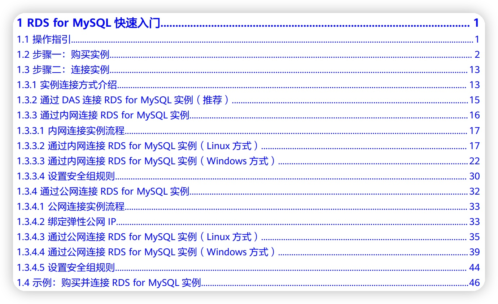

### 排名？跑分？竞标？ - 如何体现（中国）数据库能力？ 

#### 序言：我们为什么痴迷排名

中华文化基因的问题。我相信有些读者会说海外也看排名啊，的确如此，然而万事怕细节，而不是黑与白。如果有读者真正的生活在西方社会或者常年与海外作业务合作，就会发现排名在做决策中的地位和投资回报的平衡中，中华文化与西方文化有量和质的区别。

之所以说是中国文化基因的问题，可以追溯到中国的第五大发明：科举制度。自隋唐以来，科举这个对中国千又五百年的社会发明，影响深远超另四大发明。科举制度的一个特点就是考取与没有考取，进士榜单上的排名会直接影响一个人的一生，以至于一个家族的兴衰。有一些社会阅历的读者，了解些许苦读的艰难，经历多次被否定的挫折，设身处地到范进的生活空间中，多年一朝得中，喜若狂人绝对是正常的反应。不展开了，推荐两本书：瞿同祖的《清代地方政府》和张仲礼的《中国绅士研究》。

如果说科举制度离我们太遥远没有感觉的话，那99%的读者应该经过那个叫高考的东西（保送清北复交浙的那几位朋友请主动退下），80%的读者应该做过招聘相关的工作。当看到一个候选人的背景和简历的时候，你第一眼看的是不是学校？标准术语：第一学历决定论。人为划定的985，211，Top2，C9，即有很多主观性和偶然性，又被用人单位作为最主要的硬件指标。在简历上一个985毕业的学生，不管是考公考教职，还是进入大厂，都会很轻松的跨过简历筛选的第一关，甚至是负责招聘的HR的重要KPI。而能力很强但是第一学历不够“好”学生就非常辛苦，他们投递简历的过程便是挫折教育了。

这就是现实情况，也是我们工作中常用的方法。不是黑与白的对错问题，而是在有限的精力资源和有限的信息获取途径下，做了招聘者认可的**合理**的取舍。

我们理解一个数据库也是如此。就好像很多面试官或没有能力或没有精力去评价全面评价一个985与一个二本学生的真正工作能力，大部分用户包括圈内的数据库专家，也许没有能力和没有权限去看数据库内核的code，也许没有时间或资源去试水和实际使用的诸多数据。于是我们就看的榜单，这也是一个**合理**的取舍。（modb中国数据库2024年1月报告包括292个数据库， https://www.modb.pro/dbRank)

#### 一、Gartner 数据库魔力象限

全称《云数据库管理系统魔力象限》Magic Quadrant for Cloud Database Management Systems

TTHW(Time to hello world)是指用给定的编程语言编写一个“Hello, World!”程序所需的时间，这是衡量一个编程语言易用性的标准之一。由于“Hello, World!”程序主要的介绍对象是**不熟悉该语言的人**，“Hello, World!”程序越复杂可能越表明该编程语言不易使用。 [^B1] TTHW的标准已经被扩展到多个开发者领域，比如API设计体现开发者采用该API的容易程度。

具体到数据库，门槛便是客户在第一次尝试使用该产品过程中需要耗费的成本和资源，包括时间成本。我把它总结为**15分钟测试**[^B4]：从一个技术人员听说过某一个产品，，到可以运行这个产品，完成第1条SQL语句所需要的时间。影响该云数据库产品的“15分钟”门槛是从多方面的：账户生成，产品下载，代用券充值，系统设置，安装部署。然而有几个假设是必须的：
	
1. 环境：或者是免费的云环境；或者是**单机环境**（macbook是最常见的）
2. 费用：**没有费用**。千万不要认为1元或0.01元是合理的（掏出信用卡/支付宝的过程，就轻轻松松的把门槛变成了墙）
3. 技术能力：拥有**3～7年的工作经验**的主力开发，他们也是真正的用户。
 
 
[^B1]: https://zh.wikipedia.org/wiki/Hello_World
[^B4]: 全称为15分钟10刀测试。15分钟是现代人在正常环境下可以保持专心的时间段, 10刀是这十五分钟的人力成本

#### 二、2小时 vs. 2天，学习中成长
时间倒退到2017年。当时有幸在国产某分布式分析型MPP数据库做研发相关的工作，产品架构和业务都是对标Teradata和Greenplum。当时还以onPrem部署为主。产品在Beta阶段，已经有一些重量级客户在尝试使用。我们感性的认识到机群部署的困难在阻碍业务的成长，团队希望进一步量化和具体化其中的问题。于是设计了“15 minutes test"（准确的说是 3 days)。

刚好团队请到一位在IBM数据库团队工作了5+年的同事，非常符合条件：1）有足够的数据库经验；2）不熟悉待评估的产品。于是入职的第2天，便提供给该同事所有的内外文档和标准的服务器，任务是部署我们的MPP和竞品数据库TeraData。结果是：

	* TeraData： 2～3小时（没有竞品TeraData的经验，只采用公开的文档）
	* MPP： 2.5天（头一天没有部署成功，第二天请设计部署脚步的同事支持帮助）

这是在6年前，云数据库还不成熟。线下安装一个复杂的分布式数据库，用个半天时间是可以被接受的。即使如此，差距是明显的，也就是说**一位在数据库行业耕耘多年的同事，无法根据已有的文档独立部署安装**。可想而知，客户将是束手无策的。客户一般是达不到这位同事的技术能力，更谈不上能够接触内部文档和直接获得工程师的协助。在当时如果要部署该数据库，就必须由公司人员到现场去安装（事实也如此）。**无法通过“15分钟法则”就意味高昂的现场服务成本，完全无法在国际推广**。

可喜的是，该MPP逐步成熟起来，通过开源和云化，已经在国内市场占有举足轻重的地位。

#### 三、面向国际的T & T

分布式HTAP数据库**TiDB**。从Day One, TiDB就完全拥抱开源，让开发者用起来是成功的关键。2018年的时候，TiDB还没有云化，刚刚做了新结构的改造，号称可以在一个单机环境下运行。我当时把它安装到了我的2017 MacBook Pro上，是一个docker上的虚拟环境，安装过程基本上满足了上面提的15分钟测试（花了不到一个小时时间，安装步骤还是比较清晰的）。不过在我完成了几个简单的SQL之后，TiDB把Mac的资源占满了。还没有机会再进一步尝试功能，就卸载了。

同样一个产品，当2021年我再一次安装的时候，在同一台MacBook Pro，它的提供了针对本地cluster(macOS and Linux)的部署TiUP，轻轻松松的通过了"15分钟测验"，这次是真实的15分钟。很容易的让我完成了数据库事务能力与MySQL的对比工作。现在TiDB提供了直接的云化的产品，在K8S上做了部署的提高。中国数据库行业，TiDB是走向国际比较成功的一个团队了。有很多东西，值得我们学习。

在2022年我接触了一个刚刚出海的时序数据库产品**TDengine**。当时我在咖啡馆约了交流，刚好早到了半个小时，在买咖啡和朋友到达之间，我完成了TDengine的安装部署和使用。还是上面提到了那台2017的Mac。这是另一个生长于国内，并且有能力出海的数据库产品。

#### 四、对云数据库的挑战

相对来说，单机版的数据库比如MySQL或PG，一行安装：` $ brew install mysql`, 是比较容易在开发者个人环境运行的，满足15分钟测试。

上面两个例子中都是集群数据库。它的挑战在于本身不是为单机版设计的，正常配置会要求多个节点。但我们可以看到这些成功的先行者们都会想方设法让产品可以落到每一个开发者的开发环境，比如一台macbook。 

然而云数据库，比如RDS-MySQL，要增加了几道门槛。以华为云为例，其安装部署文档
[云数据库 RDS 快速入门](https://support.huaweicloud.com/qs-rds/rds-qs.pdf)中RDS for MySQL 快速入门有46页，步骤一“购买”11页，步骤二“连接”33页。云数据库的自动化了安装部署，同时添加了规格和网络配置的步骤。要公平的讲，这些步骤在正式上产品(product environment)的时候都是必须的也是耗费人力资源的，近五十页的文档也是为了保证全面完整性所必须的。同时，**产品设计者忽视了试用者的“15分钟法则”**。

华为云数据库RDS首页宣传视频中宣称“部署到访问只需几分钟”（视频第33秒）。如果不是专门操练该流程，而是首次使用该产品的程序猿。根据该教程一步步在浏览器上，点击鼠标，这将是一个小时的操作。而且是在不出错的情况下，并且不包括需要注册账号，付款等。远远超过了上文提到的15分钟准则。

公平的说，阿里，腾讯，火山，都面临类似的问题和挑战。有心的读者们任选一个尝试一下，假设你之前没有被训练过，看看30分钟能够走到哪一步？多长时间可以完成第一个SQL语句？海外成熟的AWS，GCP等等也没有银弹，只是相对来说，海外的云厂商在步骤上更人性化一些，比如说在生成实例时，把说明的文档同生成实例的步骤在浏览器并排安放，便于使用者在同一个屏幕抄作业。同时海外的云数据库采用了下面一节的解决方案。

#### 五、产品与用户之间的距离

虽然没有放之四海而皆准的银蛋，办法总比困难多。

* TDEngine采用操作系统的Package management，`yum`，`apt-get`，  `brew`。这是开发人员最熟悉的方式。
* TiDB的方式更加有趣:
	1. 为本地部署开发了`TiUP`
	2. 只是玩玩的话，就来[TiDB Playground](https://play.tidbcloud.com/)
	3. TiDB Serverless。 类似现在的“预制菜”。 既然安装部署门槛比较高，不如预先开好服务。用户signup TiDB Cloud之后，就直接指派一个Serverless cluster, 完全**跳过这个门槛**[^D1]。
* IaC（infrastructure as code）。成熟的云服务使用者都已经摆脱了浏览器和点鼠标为主的操作，因为围绕浏览器的鼠标操作not programable, not serviceable, no quality control, no version control, not scalable。IaC的理念在国际已经非常成熟。请参考大约两年前阿里数据库团队的设计的一些[Terraform为基础范例](https://github.com/alibabacloud-howto/database).

海外数据库类产品，比较流行的上面提到的后三类：Playground(例如Airbyte)，预生产（Serverless Instance/Cluster - Bigquery, Snowflake, GCP-RDS), IaC (AWS CloudFormation, HashiCorp's Terraform) 。相信对于国产数据库产品是有启发的，比如NineData为用户提供了 2 个免费的 MySQL 测试数据源[demo_datasource](https://docs.ninedata.cloud/quick_start/demo_datasource)，便是采用“预生产”手段，这样用户在账号建立后，就可以立刻体验SQL 开发，数据复制，备份等功能。
	
写在最后的话，如果您是初创企业的CTO或大厂的决策者，对于有志打造走向世界的产品，15分钟测试便尤其重要了。因为国内比较常见的驻场和人工支持在国际是昂贵到无法逾越的鸿沟。请不要错过任何一个新员工带来的机会。入职的第一天，请这位或实习生或行业大佬完成hello world。他的TTHW便是您的产品与用户之间的距离，**贴近客户从15分钟测试做起**。

#### 尾巴

在笔者采用15分钟法则尝试的数据库中，Neon（一个Serverless计算和存储分离的Postgres）是最好的：一分钟之内完成的hello world。

本文的部分思路是在西湖边的西泠印社完成的。

[^D1]: GCP等也采用类似的方式。

