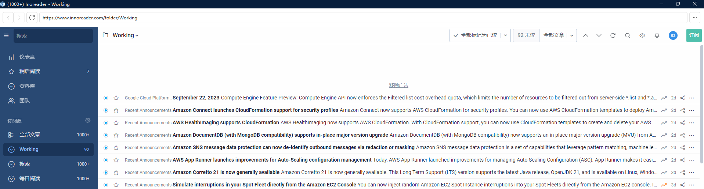
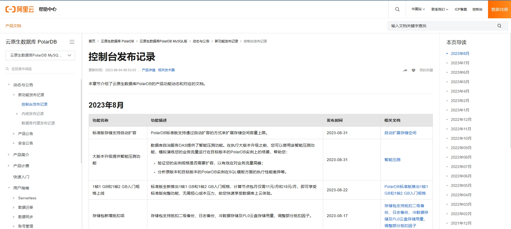
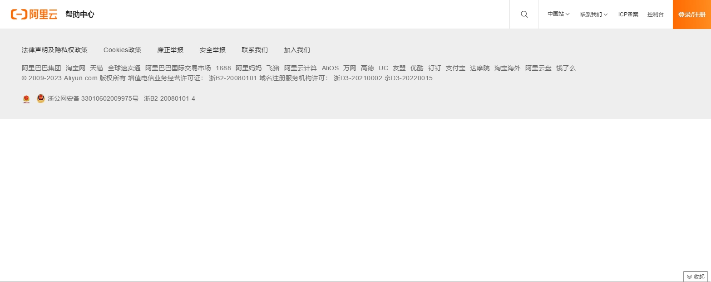
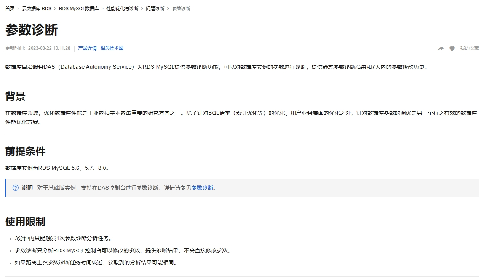
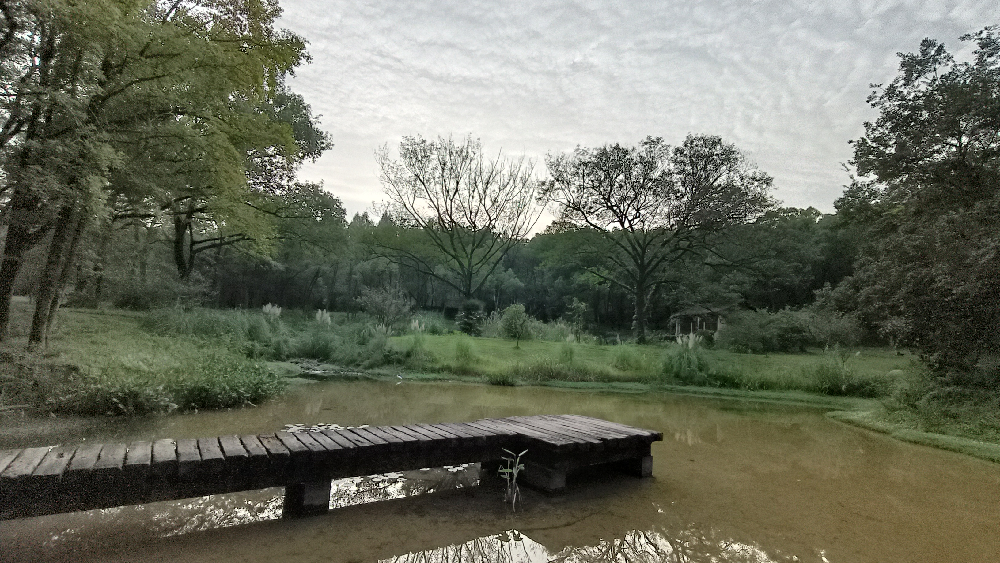

### 中国数据库走向国际的门槛 : 如何发布和获得Release Note？

***魔鬼在细节***

上周讨论的**15分钟法则**是笔者近10年代在中国数据库开发过程中的切身体验，而今天聊的一个小的题目，却是过去一个月被一个年轻的实习生教育的结果。

#### 一、背景：“简单”的工作

大家可能注意到本公众号，每周发布一次个数据库相关的“行业动态”。

动态的后台整理工作大部分是由人工完成的，其流程渐渐规范化后，最近我们尝试请一位年轻的同学来完成。部分是因为公司业务发展需要请更多的青年才俊加入；部分是希望在NineData数据管理与AIGC融合过程中，探索新的方向，Eating own dog food。

* 任务： 每周收集几大云厂商（阿里，华为，腾讯，火山；AWS, GCP, Azure）的数据库相关的release note，提取其重要内容。
* 关键：完成从全手工（从官网copy/paste)到部分自动化，达到可扩展（scalable）的效果
* 输出：markdown 文档

为此我请到了一位985高校非计算机科班研究生。These are our stories.[^A1]  [^A5]

[^A1]: 《法律与秩序》（英语：Law & Order）是美国的一部以警匪和律政为题材的电视剧。开篇语：“There are their stories”。
[^A5]: 本文体验部分由该实习生根据其直接工作感受完成。后期由本文作者整理观点和语言。

#### 二、国内外云厂商的对比

##### 2.1 国外：“老朽”的RSS[^B1]

考虑到多重因素，我和该同学都担心获取国外云服务商云数据库的相关信息与动态的难度。因此决定先比较成熟的AWS，GCP，Azure这三家云服务商入手。出乎意料的是，并没有遇到大的困难。由于这三家均支持**RSS订阅**，该同学要做的只是把他们的订阅源添加到feed阅读器中[^B3]。根据可能需要定制规范一下订阅栏目和范围，数据便自动收集进来，而且基本上是一劳永逸[^B5]。

工作的轻松有赖于**国际云厂商在信息发布方面的规范性，甚至要感谢他们的"懒"，采用二十多年前的老技术**。SQL生于上世纪70年代，RSS可以追溯到95年，99年正式发布。衡量某技术的好坏在生命力，而不是“创新”。

谷歌在更新文档方面做得非常完备，各种更新、修复都可以在更新公告中查到，且用不同颜色标注的非常清楚；而亚马逊则可以选择“数据库”这一大类别，然后直接查看“数据库”类别下所有具体产品的更新。

[^B1]: RSS是上个世纪末第一次互联网时代的产物，由Netscape首先发布的。
[^B3]: feed 阅览器很多，比如inoreader
[^B5]: 初始人工为40分钟，添加新RSS数据源只需要几分钟，每周维护成本可以近似忽略。

##### 2.2 国内云厂商：说不清楚的别扭

当目光转回国内时，便一脚踢到了铁板上：国内的阿里、腾讯和火山均不支持RSS订阅。抱着一线希望还联系了火山云的售前客服，得到的回复是“如果想要了解最新的更新动态，只能通过站内信。” **RSS这条路看来在国内是走不通了**。

这位年轻同学还是挺有主观能动性的，他又尝试了非传统方式来获取国内云服务商的更新动态和信息：**网页更新监视插件**。在浏览器安装这一插件后，其便可以自动检测网页更新并发出提醒，腾讯云和火山云就这样被他以这种方式“拿下了”：虽然没有RSS那样简便，总比手动一个个翻网页强不是？然而阿里云，又遇到了难题：阿里云技术文档的网页每次打开其javascript渲染的结果都不相同，列表与数据的位置都会发生改变，网页监视器将其误判为网页更新，导致网页更新监视插件无法使用。

于是，他直接上了终极武器：**爬虫**，对阿里云文档的相关网页进行了爬取，得到的结论是阿里的**“好帅的反爬技术”**。阿里云的说明文档采取了较为严格的反爬机制，爬虫在一开始可以正常的发送请求、访问网页，但很快阿里云网页的所有元素都会被隐藏，从而导致爬虫爬取信息失败。

下图为爬虫刚访问网页时的情况

>

下图为阿里云网页检测到爬虫后隐藏所有元素的情况。
>

说不清楚的别扭： 感觉阿里的网站更加用心，技术更加先进。可是产品更新发布不是宣传渠道的一部分吗？**为什么用如此高级的“保险箱”保护本应努力推广的材料？**。用监视插件和爬虫也不是我们的初衷，有什么好的办法吗？

#### 三、朴实的工作和纯洁的抱怨

#####  3.1 最后的努力

公司请实习生，总是希望“双赢”：公司希望实习生完成的必要的工作，同学也希望能够在工作中完成学校到社会的跨越，增加其简历的价值。如果采用最原始的方式：手动翻页搜集，虽然可以完成公司的任务，该同学的成长是非常有限的。可是经过三次(RSS, 网页更新插件和网络爬虫）尝试之后，他不得不遗憾的返璞归真，手工刷网copy/paste。**用时最多的日常，却是对于简历价值最低的工作。**

然而，又有了问题：阿里云并非所有的更新都会放在更新公告中，一些功能的更新和修复需要查询相关功能的说明文档才能发现。而判断他们更新与否的依据也只有更新时间。与GCP、AWS事无巨细的更新公告相比，阿里云的更新公告较为简洁，很多功能的小型修复与更新并不会出现在说明文档的更新公告中。 如下图所示的优化，在产品更新更新公告中看不到,因为不属于“新功能发布”：

##### 3.2 被年轻人“教育”

经过两周的撞墙之后，我请他把自己的真实感受写出来：

>如何看待国内云厂商在信息发布上的操作？以阿里云为代表的国内各大云服务商在信息公开方面设置的重重阻碍，实际上代表了中国互联网**“流量为王”**的思维定式，这一思维定式的最终结果便是“私域流量”——即“肥水不流外人田”“肉烂在自家锅里”。

>国内云服务商在消息通知上更倾向于站内信——即便站内信对于用户来说不太方便。如腾讯云为了使站内信能够推送到用户的移动端，设立了“腾讯云助手”公众号，并引导用户关注微信公众号，由微信公众号将站内信转给用户产品更新公告，这一操作的最终结果便是**数据库动态消息被淹没在微信每日数不清的99+红点中**。

这位年轻的实习生用“流量为王”来解释所看到的现象：用户获得信息必须去云官网上手工查阅，于是增加了点击率，帮助该部门完成KPI。联系上文阿里的高级的反爬虫技术，是不是希望获得更多的阿里网页点击，期待点击数转换成客户数？

以上根据黑盒体验，演绎出的猜测。可能是片面的，特别恳请了解内情的朋友批评指正。

#### 四、惴惴不安的思考

总结一下国际云厂商相较于国内云厂商在信息发布的优势：

* 国际云厂商支持**RSS订阅**，且相关技术文档、更新动态可以被搜索引擎，爬虫检索到；
* 国际云厂商的**信息发布具体而微**——小的修复也可以在技术文档的更新动态中看到；
* 国际云厂商在**信息分类做得完善**——如亚马逊可以直接查看“数据库”这一大类别下所有具体产品的更新动态；微软在此基础上还可以根据新功能不同的发布状态再次进行筛选。

感想来自于刚刚入行的实习生和非运营专家的笔者，两个外行指手画脚的时候心中难免惴惴。不过我们也算是这些运营工作的目标客户，也算是反馈一个小众的角度的声音吧。如果某个厂商的重度用户，那这个重度用户是如何收到到这些出版发布信息呢？我们的好奇心，期待圈内朋友不吝赐教：

1. 厂商发布信息的有效渠道是什么？[^D3]
2. （感觉上）云厂商的数据库发布信息是每个单独产品负责的, 那么该云厂商的用户如何有效的收到十几甚至几十个产品的更新呢？
3. RSS是否是比较好的方式？[^D5]

[^D3]: 短信，微信公众号，钉钉群发？ - 我们的体验是推送似乎是非常泛滥的，而且不系统。
[^D5]: RSS在15年前非常火，现在国内已经基本不用了。虽然在我们这个小项目中RSS是非常简洁方便的，海外呢？

#### 尾巴：不着边际的乱语

过去一段时间写了四五篇感想，本篇是特别别扭的一篇。既不知道什么是正确的，又不知道怎么能够做好。**云厂商的产品发布，不应该像广告纸一样送到我手里吗？**

微信公号，钉钉客服群，discord, reddit, RSS feed, LinkedIn post....。社会群体中的运作方式可以追溯到文化和思想传统。比如说很多发布是采用了微信公众号的方式，而微信又在大部分情况下是私人和工作功能的混合体。这便是与欧美世界是明显的差异之一。无所谓对错的，存在即合理。在国内微信公号是非常重要，是垄断性平台，本文也不例外的抱了大腿。

Release note是几十年开源社区做的最基础的一项工作，已经有了其约定俗成的规范。国内高手做的开源项目，更加贴近国际社区的方式方法，对于他们来说走向国际的包袱就轻很多。

上周提出的[“15分钟准则”](https://mp.weixin.qq.com/s/NlwtxtX8AOilsP5x0qRKYA)是一个比较容易实践的建议，而本周就有些纠结了。“魔鬼在细节”，每一步小动作都体现到软件出海的艰难，**千万不要去教国际上的客户使用微信和钉钉，我们试过，太痛苦了**。

另外在组织这篇文章中，意外的发现了 [PolarDB 数据库内核月报](http://mysql.taobao.org/monthly/2023/08/)， 是通过RSS feed 传递出来的 https://rsshub.app/aliyun/database_month。从2014年开始，最新的一期是2023年八月。**任何坚持十年的一件事情都值得我们的尊重**。

<!--
[^E1]: 推个硬广：最近在听金观涛的《中国思想史系列讲座》和秦晖的《中国思想史》。前者是金先生在2017～2018杭州中国美院的课件；后者是秦先生在大家讲堂的讲座，秦先生在清华上课的录像也有关于“思想变迁”的内容。
-->

穿过**浙大边的青芝坞，便是的西湖边的“灵峰探梅”**，本文的部分纠结留在探梅的路上。

#### 附录部分RSS feed

* https://rsshub.app/mysql/release/8.0
* https://aws.amazon.com/about-aws/whats-new/recent/feed/
* https://azurecomcdn.azureedge.net/en-us/updates/feed/?category=databases&status=nowavailable
* https://cloud.google.com/feeds/gcp-release-notes.xml

