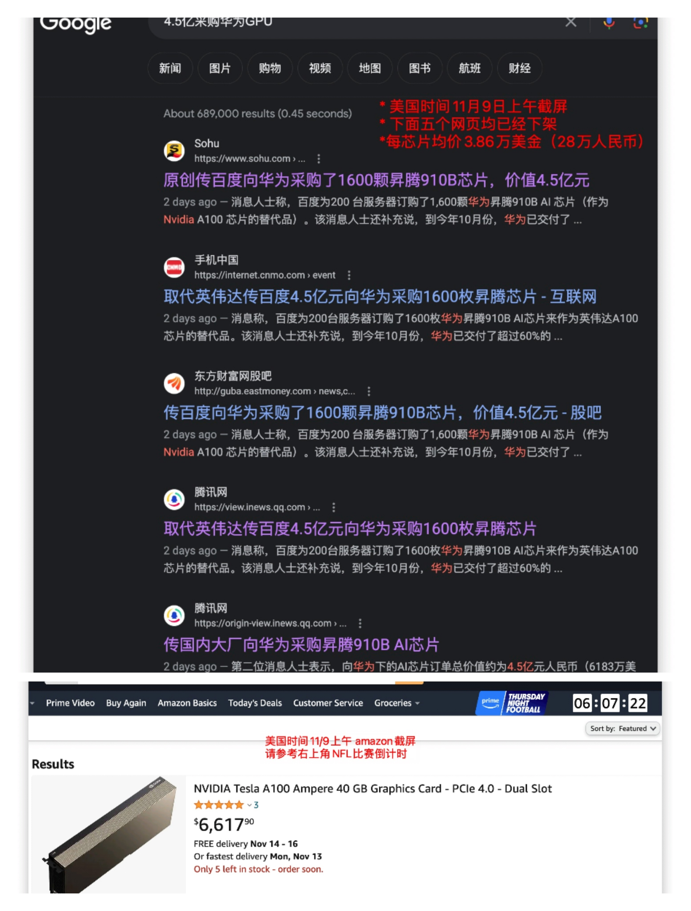
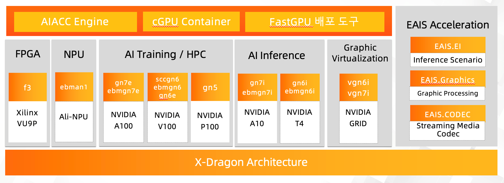
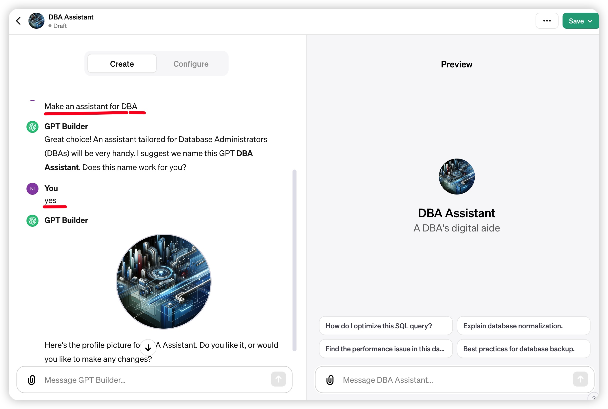

## 丢掉当幻想：在AI的风口上没有飞起的“猪”

OpenAI做开发者发布大会的时候，刚好在从上海飞回旧金山的。以我惯性的懒惰，自然是先倒时差。昏昏沉沉的三天之后，再去搜罗网上已经有的各种评论文章（部分转载在本文最后）。讲了什么，发布了什么？都在公开信息上，建议大家尽可能移步到“油土鳖”去看，而且配有自动翻译中文的功能。Keynote总共才45分种，真心建议大家去看原版。科学上网是当今学习的必要工具。

* 《OpenAI DevDay, Opening Keynote》 (link: https://www.youtube.com/watch?v=U9mJuUkhUzk)

本文只是书写一下个人的直观第一感觉：采用抄作业的方式已经无法成为风口上的“猪”。

OpenAI好像发布的缓慢，实际上每次发布都会直接影响业绩的方向。上个月本人分析了国内关于AI的四种公司，都被这次发布所有重大影响。

### 1. 现实，还是震撼？

某网文题目是“短短 45 分钟发布会，OpenAI 如何再次让 AI 圈一夜未眠” （其他震撼性题目请参考本文末）。老实讲，任何在业界工作过一段时间的人都不应该惊讶才对。从去年11月ChatGPT发布，这一年中发生了什么？让我们结合发布会和最近的新闻看看哪一项是出乎意料的？

#### 1.1 价格战： GPU和AI token

对习惯以价格取胜的中国公司是赤裸裸的降维打击。

关于GPU的价格，请看亚马逊上的零售和最近百度的采购的新闻（该新闻已经下架）。直观感觉华为的芯片的批发价是英伟达零售价的6X（尽管百度买的是服务器，但我们都知道服务器中芯片价值是主要的部分）。本人对于GPU的价格理解非常肤浅，敬请拍砖。另，A100官方报价为1万美金

AI token呢？ GPT-4 Turbo“更强了但更便宜了”，降价到以前的1/3～1/2 （11:19）。

#### 1.2 差距：不是三个月！合作伙伴是看不见的战场
一个月前某AI大厂（括号不限于国内）号称比肩GPT4。现在GPT4-Turbo出现了，不是说该大厂与世界领先OpenAI差距只是3~6个月呢。如果这是您的结论，那我想说太肤浅了。

“太阳底下无新事”。发现现代商业公司在用最传统的方法打败对手，那便是生态和合作伙伴。30年前的Oracle是这么做的，10年前的Snowflake也是这么做的。一个商业公司的技术领先只是其成功的第一步，OpenAI已经迈进了关键的合作伙伴接口这一步（GPTs，21:13)。这是一个文化理念的超越，也就是说“虽然我很牛，但让AI的伙伴可以在我的平台上挣钱，我才能成功”。OpenAI不去做芯片(not yet, https://www.reuters.com/technology/chatgpt-owner-openai-is-exploring-making-its-own-ai-chips-sources-2023-10-06/ )，在横向方面与微软绑定github CoPolit(所以微软的CEO Satya 才来站台）。邀请估值50亿美金Zapier为范例，便是keynote上给予合作伙伴的message：我们一起挣钱吧！

合作伙伴生态的建立，以及与合作伙伴的共赢，使三个月的技术差距变成了三年的生态代差。

#### 1.3 讨好开发者在*2分28秒*：国内 vs. 国际

国内商业环境中甲方与乙方的地位的高低是非常清晰明显的（计算机技术行业算比较好的了）。国内开发者一般是处于乙方地位，讨论商业的成功经常会戏虐的将自己滑跪的姿势称为核心竞争力。相对而言，国际上客户和厂商更像伙伴，而且同时讨好开发者，因为他们既有架构选择的决策权，也有用键盘的选择权。

苹果和OpenAI都是因为开发者在商业成功中的影响力要是巨大的。这种对于开发者的讨好，绝对不限于几张PPT和或几声不痛不痒的口号。具体到本次的开发者大会，提供了
* 版权保护Copyright Shield(11:42),
* 分享营收revenue sharing(31:49), 
* 多次提到可编程性programmatically（30年老梗：正真的程序员不用鼠标），
* 并且郑重重申“we do not train on your data from the API, or ChatGPT enterprise, ever (12:00)" - 对开发者数据的保护。

这一切都是为了吸引开发者来使用OpenAI，45分钟的keynote, 最先被邀请进来的不是大厂CEO，而是几个普通开发者在开始演讲后的2分28秒。

#### 1.4  “卡脖子”？如此大政方针是你我需要考虑的吗？

这是一句题外话。

卡脖子是真实的还是臆想的？对于本文章大部分读者来说这一件事情是真实具体的。具体到是否可以用GPU，是否可以直接使用openai的token，所以很多公司的CXO们“卡脖子”作为长期战略的一个关键性决策因素。

本人对于此是一个复杂的心情。借题输出一点偏见：卡脖子是国家层面的大的地缘政治环境，对于大厂大平台影响会比较大，他们也有实力去战略性的安排。而作为一个初创企业，是无法做到什么事情都自给自足，完全封闭的。也不可能像华为一样，早在十几年前就决心攻坚芯片，或者压三年的货。在这种环境下，初创企业CXO们，无法既要也要，我们只能假设未来的世界还是开放的，还是还是可以互通有无的。具体到AI，我们在做大（小）模型，不应该局限于国内的GPU硬件或者局限于国内的产品/场景，而是去看如何跟整个国际来做合作（我相信真正有战略眼光的CXO们正式也是这么做的）。否则，难道真的用6X的价格买GPU算力吗？

对于初创企业，法务问题远比技术问题好解决（关于相关解决路径，本文就不展开了）

那大厂呢，他们也不会拒绝，字节购买10万A100和H800 GPU加速卡（2023六月新闻：https://pandaily.com/bytedance-and-alibaba-place-massive-gpu-orders-with-nvidia-fueling-the-ai-race/)；阿里神龙架构图包括A100（2023四月官网blog: https://www.alibabacloud.com/blog/introduction-to-alibaba-cloud-gpu-service_599905）

#### 1.5 One More Thing

GPT4 Turbo已经拥有了2023年4月的知识(7:57)，和实时查寻的能力（笔者亲试）。

### 2. AI的四大集团 

ChatGPT掀起的人工智能的第N次浪潮（DeepBlue, Watson, AlphaGo)渐渐进入浮尘落地后的实战期，基本上区分出四大集团：

* 第一类：直接与OpenAI竞争的通用大语言模型，比如百川，Llama2
2. 第二类：投资硬件提供算力资源的云厂商。通用云厂商如阿里，专注高性能计算（HPC）的比如本月初刚刚在北交所IPO的并行科技，其董事长陈健相信“大模型对算力的需求极大，动辄十几亿，光电费就要几百万，企业采用租用算力是风险最小、资金利用最优的方式” （并行科技陈健：超算架构大模型算力，买不如租！）
3.  第三类：帮助使用LLM的平台类公司群体。即有巨无霸Huggingface(两个月前以45亿美元估值融资2.35亿），上周同大家介绍的刚刚崭露头角的Lepton AI(阿里前副总裁贾扬清创立），也有上次同大家分享的Predibase。
4. 第四类：相对小型的初创企业去训练有技术专属性的“小”模型。在开源的通用LLM（第一类）的基础上，租用算力（第二类），采用有业务专属性的数据集（比如数据库优化）和最新的算法（比如LoRA)，为其提高客户服务质量和效率。笔者所在的NineData便是第四类。通过LoRA模型来训练数据库和NineData的数据库开发和复制产品相关的基础模型。

这四类厂商都会被最新的技术影响。

* 与openai直接竞争百川，必须思考在技术上落后的情况下如何商业化？否则合作伙伴就都被拉走了。简单的城墙并不会阻碍国内的开发者去使用海外的模型，而价格战的优势和控制权也不在自己手中。

* 投资硬件的要思考，或者从大趋势上。英伟达的老黄或者AMD的苏妈，是否可以说服国会改变政策（一直在尝试）或者用产品和律师绕过（H800 and A800)? 或者巨大的价格差诱惑水客们的介入？思考一下早期iPhone有多少是从香港进来。只要利益足够大，任何货物都可以跨国界。

* 小型初创企业，比如说训练数据库的，是否可以打赢OpenAI已有的? 或者是笔者用两句命令，一共6个英文单词和两分钟生成的，DBA Assistant？

* Huggingface必须严肃对待GPTs和"The App Store of AI"。

### 3.  写在最后的灵魂三问

* 招聘HR： 你的候选人是否了解会使用科学上网（中国顶级的科研机构如清华、交大；大厂如华为，阿里，都有一个叫做加速器的东西） 
* 平台类产品CXO：尤其是大厂平台企业如阿里云，你有什么办法可以帮助你的合作伙伴挣钱，profit sharing? 
* 初创企业的CXO：给自己一个挑战，假设没有“卡脖子”，是否勇于打造面向世界的产品？（数据库市场份额，大中国区只有不到10%，为什么要自己内卷？）

### 其他关于OpenAI 开发者大会的问题，

未来，除了引人点击的标题外，还需要人类手写类似的大会文章吗？

* 《“一夜回到解放前”，OpenAI正在摧毁创业公司？》 https://www.toutiao.com/article/7298669664631341606
* 《开发者大会上，OpenAI展示如何杀死所有寄生的小创业者们。。。》 https://mp.weixin.qq.com/s/8Sr9_DP20D-aZs8mkhMskw
* 《短短 45 分钟发布会，OpenAI 如何再次让 AI 圈一夜未眠》 https://mp.weixin.qq.com/s/EK9j4pTAkdpNRtQZ_XwQ-w
* 《用过GPT-4 Turbo以后，我们再也回不去了》https://mp.weixin.qq.com/s/1oGfwQFhCsiFKOqPDS6GcQ
* 《ChatGPT新功能曝光！OpenAI首届开发者大会抢先看》https://mp.weixin.qq.com/s/fZAy43CQxoWHPqeyDB5xxA
* 《看完OpenAI开发者大会，BAT都沉默了》 https://new.qq.com/rain/a/20231107A04N2P00
